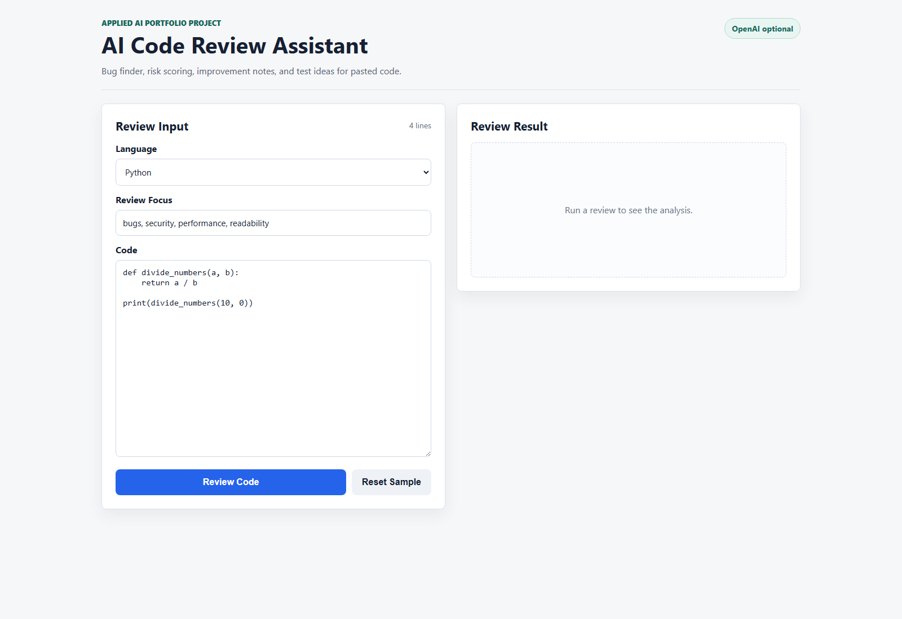
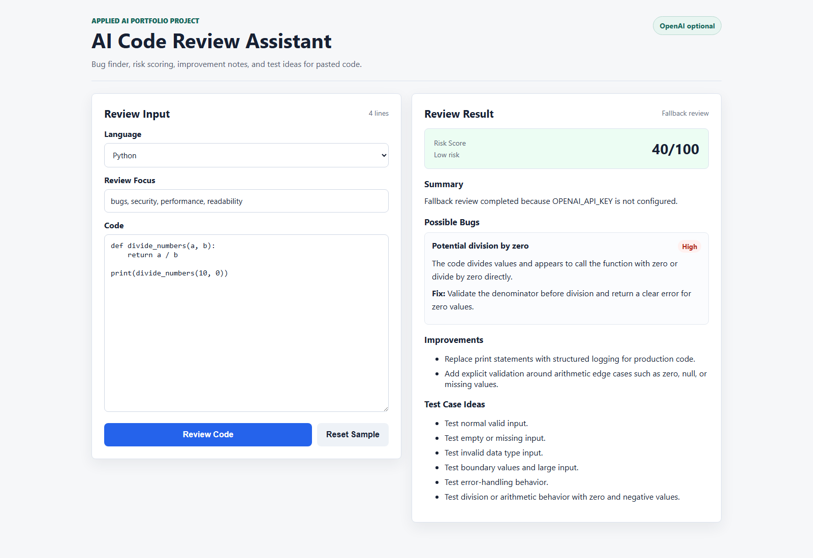
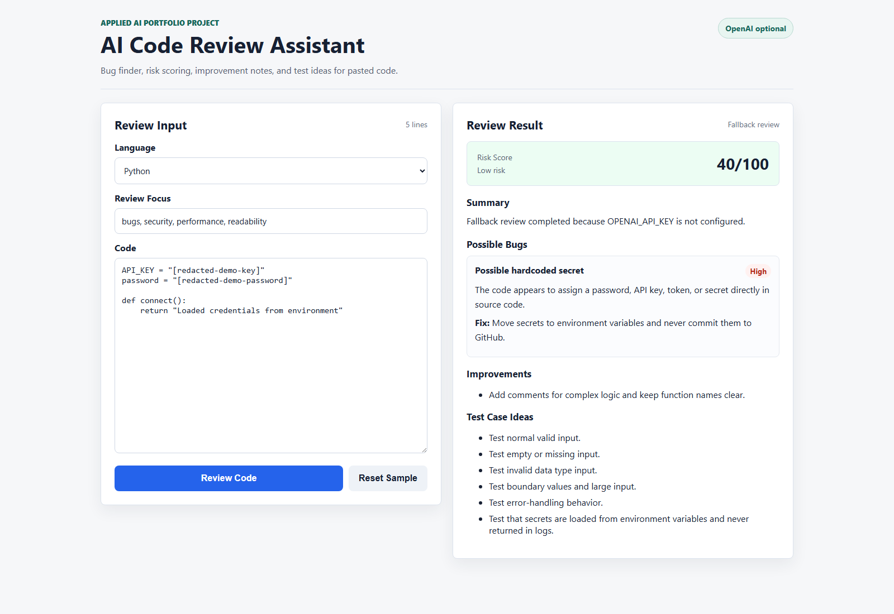
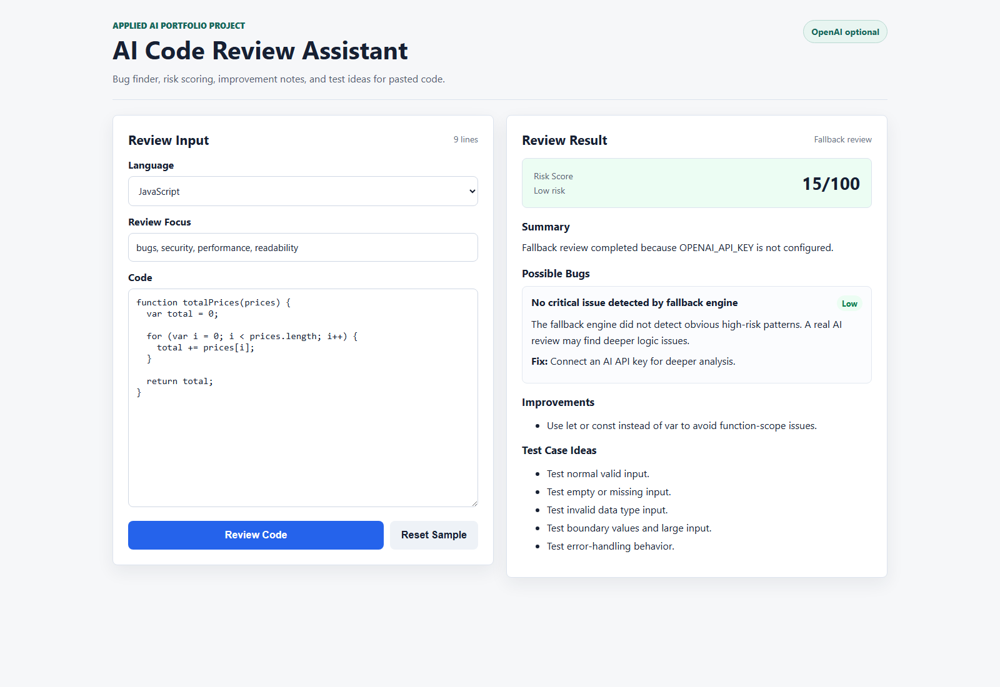
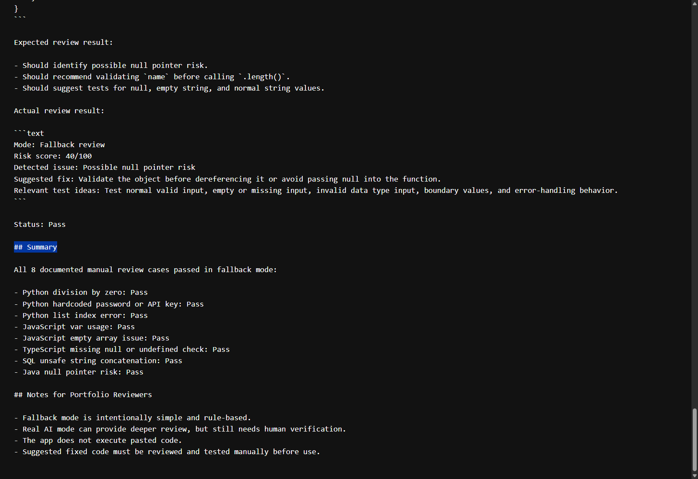
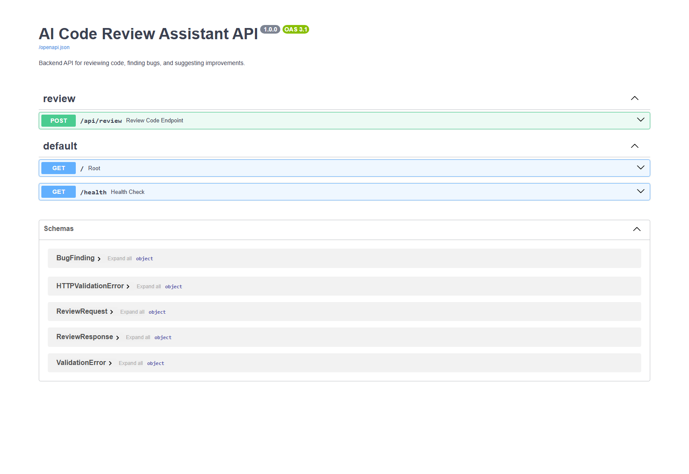

# AI Code Review Assistant

A full-stack AI Code Review and Bug Finder project built for an Applied AI Engineer portfolio.

Users paste code, choose a programming language, and receive:

- Code summary
- Possible bugs
- Risk score
- Improvement suggestions
- Suggested test cases
- Optional fixed code when the AI provider returns one

The backend uses an OpenAI-compatible API when `OPENAI_API_KEY` is configured. If no key is available, the app still works with a local rule-based fallback review engine.

## Live Demo

- Frontend: https://ai-code-review-assistant-seven.vercel.app
- Backend health check: https://ai-code-review-backend-c17u.onrender.com/health
- Backend API docs: https://ai-code-review-backend-c17u.onrender.com/docs

The live demo runs in free fallback mode with no `OPENAI_API_KEY`. It uses the backend rule-based review engine to detect common issues such as division by zero, hardcoded secrets, JavaScript `var` usage, missing null checks, unsafe collection access, and SQL string concatenation risk.

For free local AI review, run an open-source model with Ollama and point the backend to `http://localhost:11434/v1`. See [docs/free-local-ai.md](docs/free-local-ai.md).

## Tech Stack

Frontend:

- React
- TypeScript
- Vite
- CSS

Backend:

- Python
- FastAPI
- Pydantic
- OpenAI-compatible API client
- Rule-based fallback review logic

Deployment targets:

- Frontend: Vercel or Netlify
- Backend: Render, Railway, Fly.io, or Docker

## Project Structure

```text
ai-code-review-assistant/
|-- backend/
|   |-- app/
|   |   |-- main.py
|   |   |-- schemas.py
|   |   |-- routers/
|   |   |   `-- review.py
|   |   `-- services/
|   |       `-- reviewer.py
|   |-- .env.example
|   |-- Dockerfile
|   `-- requirements.txt
|-- frontend/
|   |-- src/
|   |   |-- App.tsx
|   |   |-- api.ts
|   |   |-- main.tsx
|   |   |-- styles.css
|   |   `-- vite-env.d.ts
|   |-- .env.example
|   |-- index.html
|   |-- package.json
|   |-- tsconfig.json
|   `-- vite.config.ts
|-- docs/
|   |-- ai-workflow.md
|   |-- architecture.md
|   |-- test-cases.md
|   `-- what-broke-and-what-i-learned.md
|-- screenshots/
|   `-- README.md
|-- .gitignore
|-- docker-compose.yml
|-- LICENSE
|-- render.yaml
`-- README.md
```

## Backend Setup on Windows

From the project root:

```powershell
cd backend
py -m venv venv
venv\Scripts\activate
pip install -r requirements.txt
uvicorn app.main:app --reload --port 8000
```

Backend URL:

```text
http://localhost:8000
```

FastAPI docs:

```text
http://localhost:8000/docs
```

## Frontend Setup on Windows

Open a second terminal from the project root:

```powershell
cd frontend
npm install
npm run dev
```

Frontend URL:

```text
http://localhost:5173
```

If PowerShell blocks `npm.ps1`, use the Windows command shim:

```powershell
npm.cmd install
npm.cmd run dev
```

## Environment Variables

Backend:

```powershell
cd backend
copy .env.example .env
```

`backend/.env`:

```text
OPENAI_API_KEY=
OPENAI_MODEL=gpt-4o-mini
OPENAI_BASE_URL=
FRONTEND_ORIGINS=http://localhost:5173,http://127.0.0.1:5173
```

Leave `OPENAI_API_KEY` empty for fallback mode. Add a key only if you want real AI reviews.

Free local AI option with Ollama:

```text
OPENAI_API_KEY=ollama
OPENAI_MODEL=smollm2:135m
OPENAI_BASE_URL=http://localhost:11434/v1
OPENAI_TIMEOUT_SECONDS=90
OLLAMA_NUM_CTX=512
OLLAMA_NUM_PREDICT=128
```

More details, including stronger coding model options, are in [docs/free-local-ai.md](docs/free-local-ai.md).

Frontend:

```powershell
cd frontend
copy .env.example .env
```

`frontend/.env`:

```text
VITE_API_BASE_URL=http://localhost:8000
```

## API Endpoint

Review code:

```text
POST /api/review
```

Example request body:

```json
{
  "language": "Python",
  "code": "def divide(a, b):\n    return a / b",
  "focus": "bugs, security, performance, readability"
}
```

Example response shape:

```json
{
  "summary": "Fallback review completed because OPENAI_API_KEY is not configured.",
  "risk_score": 40,
  "bugs": [
    {
      "title": "Potential division by zero",
      "severity": "High",
      "explanation": "The code divides values and may fail when the denominator is zero.",
      "suggested_fix": "Validate the denominator before division."
    }
  ],
  "improvements": ["Add explicit validation around arithmetic edge cases."],
  "test_cases": ["Test division behavior with zero and negative values."],
  "fixed_code": null,
  "used_ai": false
}
```

## Docker

Run the backend with Docker Compose:

```powershell
docker compose up --build
```

The backend will be available at:

```text
http://localhost:8000
```

Docker Compose works without an API key. To use a real AI provider, set environment variables before running Compose or create a root `.env` file.

## Testing the Review Feature

The project includes manual review examples in [docs/test-cases.md](docs/test-cases.md). These examples cover Python, JavaScript, TypeScript, SQL, and Java bug patterns such as division by zero, hardcoded secrets, unsafe array access, missing null checks, and unsafe SQL string concatenation.

Manual review test cases were tested against the live backend endpoint in fallback mode with no `OPENAI_API_KEY`. The current documented run passed all 8 cases, but this does not guarantee every possible bug will be detected.

Backend fallback tests can be run with pytest:

```powershell
cd backend
pip install -r requirements.txt
pip install -r requirements-dev.txt
pytest
```

## Known Limitations

- Fallback mode only detects simple rule-based patterns.
- Real AI mode gives deeper review but still needs human verification.
- The app does not execute user code for safety.
- Fixed code suggestions must be tested manually.

## Screenshots














## Deployment

Full deployment steps for Render and Vercel are in [docs/deployment.md](docs/deployment.md).

### Backend on Render

Use these settings:

- Root directory: `backend`
- Build command: `pip install -r requirements.txt`
- Start command: `uvicorn app.main:app --host 0.0.0.0 --port $PORT`

Environment variables:

```text
OPENAI_API_KEY=<optional-api-key>
OPENAI_MODEL=gpt-4o-mini
OPENAI_BASE_URL=
FRONTEND_ORIGINS=https://your-frontend-domain.vercel.app
```

If `OPENAI_API_KEY` is empty, the deployed backend still returns fallback reviews.

### Frontend on Vercel

Use these settings:

- Root directory: `frontend`
- Install command: `npm install`
- Build command: `npm run build`
- Publish directory: `dist`

Environment variable:

```text
VITE_API_BASE_URL=https://your-backend-domain.onrender.com
```

After deployment, update backend `FRONTEND_ORIGINS` to include the deployed frontend URL.

## GitHub Portfolio Checklist

Before uploading:

- Keep `.env` files private.
- Commit `.env.example` files.
- Commit `package-lock.json` after running `npm install`.
- Add screenshots to the `screenshots/` folder.
- Add the deployed frontend URL to the README.
- Add the deployed backend docs URL to the README.
- Include this project on your CV and portfolio page.

Suggested GitHub description:

```text
Full-stack AI Code Review Assistant using React, TypeScript, Python FastAPI, fallback review logic, test cases, and screenshots.
```

Suggested CV bullet:

```text
Built an AI Code Review Assistant with React, TypeScript, and FastAPI that reviews pasted source code, detects possible bugs, assigns risk scores, suggests improvements, and generates test case ideas. Added OpenAI-compatible AI integration with local fallback logic for reliable demos without an API key.
```

## What Broke and What I Learned

Key issues handled during development:

- AI responses can return markdown or invalid JSON, so the backend now extracts and validates JSON more defensively.
- Demos should not depend completely on paid AI APIs, so fallback review logic remains available when `OPENAI_API_KEY` is empty or the AI call fails.
- Local frontend and backend ports can trigger CORS errors, so the backend supports configurable allowed origins.
- TypeScript builds need a real `tsconfig.json`; the frontend now has one.
- Windows PowerShell can block `npm.ps1`; use `npm.cmd` if that happens.

More detail is in [docs/what-broke-and-what-i-learned.md](docs/what-broke-and-what-i-learned.md).

## How AI-Assisted Development Was Used

AI-assisted development was used for:

- Planning the full-stack architecture
- Generating and reviewing FastAPI route logic
- Improving fallback review rules
- Hardening AI JSON parsing
- Improving frontend error handling and UI structure
- Writing beginner-friendly setup and deployment documentation

The developer still verifies the result by running the API, building the frontend, checking fallback behavior, scanning for secrets, and testing the browser flow.

More detail is in [docs/ai-workflow.md](docs/ai-workflow.md).

## Security Notes

- Do not hardcode API keys.
- Do not commit `.env`.
- Use environment variables in deployment platforms.
- The fallback review engine is intentionally simple and is not a replacement for a human security review.

## License

This project is licensed under the MIT License. See [LICENSE](LICENSE).

## Current Status

The project is deployed and ready for GitHub portfolio review.

Live links:

- Frontend: https://ai-code-review-assistant-seven.vercel.app
- Backend API docs: https://ai-code-review-backend-c17u.onrender.com/docs

The project can also run locally with:

- Backend: `uvicorn app.main:app --reload --port 8000`
- Frontend: `npm run dev`
